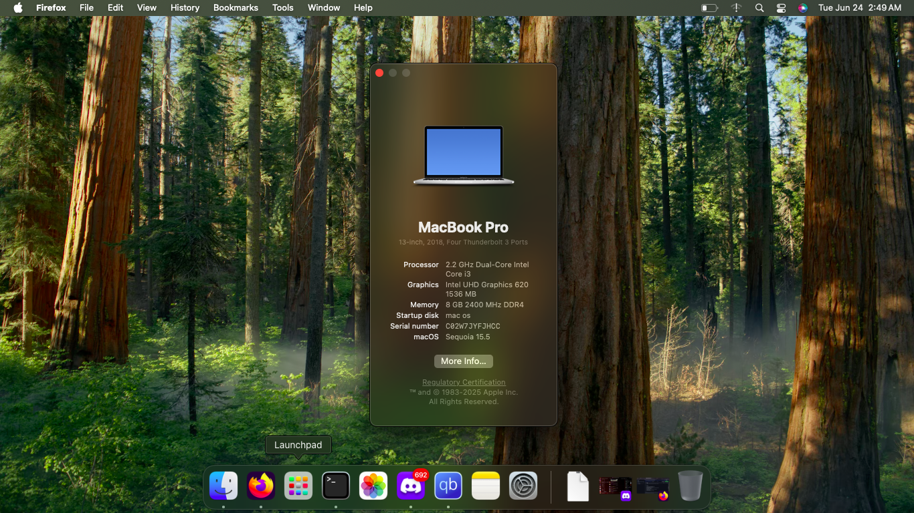

# Hackintosh EFI for Acer Aspire 3 A315-54K
I Made this Repo for everyone who doesn't want to waste time &lt;3
Here is MacOS Sequoia Working!!

## Overview

This repository contains the EFI folder and configuration files to run macOS on the Acer Aspire 3 A315-54K laptop via OpenCore.
It includes all the necessary kexts, drivers, and config.plist pre-configured for a smooth macOS installation and boot.

---

## Supported Hardware

* **Model:** Acer Aspire 3 A315-54K
* **CPU:** Intel Core i3-8130U (or similar 8th Gen)
* **GPU:** Intel UHD Graphics 620
* **Wi-Fi:** \[Specify Wi-Fi card/model, or if using USB adapter]
* **Audio:** \[Specify audio codec, e.g., Realtek ALCxxx]
* **Others:** Touchpad, keyboard, webcam supported (specify if patched)

---

## Features

* macOS Ventura up to Sequoia compatible (Tested)
* OpenCore bootloader with minimal patches
* CPU power management & SSDT fixes
* Dual Boot Windows and Mac OS working (Linux and Mac OS didn't tested)
* Native USB support (XHCI)
* Audio patched for \[codec name]
* Ethernet / Wi-Fi support (with external kexts if necessary)
* SSD and NVMe support
* Sleep and Wake working
* Battery status and brightness keys working

---
## Features that don't work
* Bluetooth (Need Bluetooth dongle)
* WiFi (Need WiFi dongle)
* Hardware Acceleration (May glitch the external screen)
---

## Installation

1. Prepare a macOS USB installer following standard OpenCore Hackintosh guides.
2. Replace the EFI folder on your USB installer with the content from this repo.
3. Adjust `config.plist` if needed, especially SMBIOS for your serial number.
4. Boot from the USB installer and proceed with macOS installation.
5. After installation, copy the EFI folder to your macOS EFI partition to boot standalone.

---

## Configuration

* The main config file is `config.plist` (OpenCore 0.8.5+ compatible).
* Use ProperTree or OpenCore Configurator to customize SMBIOS and serial numbers.
* Kexts are in `EFI/OC/Kexts`.
* ACPI patches and SSDTs are in `EFI/OC/ACPI`.
* Drivers are in `EFI/OC/Drivers`.

---

## Troubleshooting

* If you experience boot issues, try enabling verbose mode (boot argument `-v`).
* For audio issues, verify codec and kext versions.
* Wi-Fi might require external USB adapters if your internal card is unsupported.
* Sleep/Wake might need SSDT tweaks depending on BIOS version.

---

## Credits

* [OpenCore](https://dortania.github.io/OpenCore-Install-Guide/) – for the bootloader and installation guide
* [Dortania](https://dortania.github.io/) – for extensive Hackintosh documentation
* Community members and developers of kexts used (Lilu, VirtualSMC, WhateverGreen, AppleALC, etc.)
* [pxradise](https://slat.cc/paradiso) - (me lol) for making this repo and helping people <3
---

## Disclaimer

This EFI is provided "as-is" without warranty. Use at your own risk.
Make sure to backup your data before proceeding with installation.
This config is tailored specifically for the Acer Aspire 3 A315-54K and similar hardware.

---

## Contributing

Feel free to open issues or pull requests if you find improvements or fixes.
Please test your changes before submitting.
